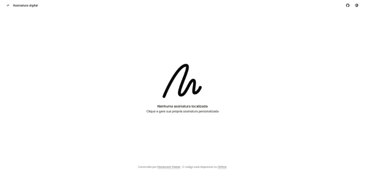

# ✍️ Assinatura Digital com Angular + Canvas



Este projeto permite que o usuário abra um modal para **desenhar sua assinatura digital** diretamente na tela, utilizando **mouse** ou **toque (touch)**, de forma simples e intuitiva.

Após desenhar, o usuário pode **visualizar a assinatura**, **baixar a imagem gerada** ou **refazer** o desenho, tudo sem sair da interface.

---

## 🚀 Tecnologias Utilizadas

- [Angular](https://angular.io/)
- HTML5 `<canvas>`
- TypeScript

---

## 🖌️ Funcionalidades

- Modal para desenhar a assinatura
- Suporte a dispositivos com **mouse** e **touch**
- Visualização da assinatura após o desenho
- Opção de **refazer** a assinatura
- **Download** da imagem gerada (PNG)
- Layout responsivo e moderno

---

## ▶️ Como Executar Localmente

```bash
# Clone o repositório
git clone https://github.com/hendersonkleber/assinatura-digital.git

# Acesse o diretório
cd assinatura-digital

# Instale as dependências
npm install

# Inicie o servidor Angular
ng serve

# Acesse em http://localhost:4200
```

---

## 🖼️ Preview

Veja acima o GIF de demonstração ou execute localmente para experimentar a funcionalidade interativa de assinatura digital.

---

---

## 🙋‍♀️ Contribuições

Contribuições são bem-vindas! Sinta-se à vontade para abrir issues, relatar bugs ou sugerir melhorias.

---
